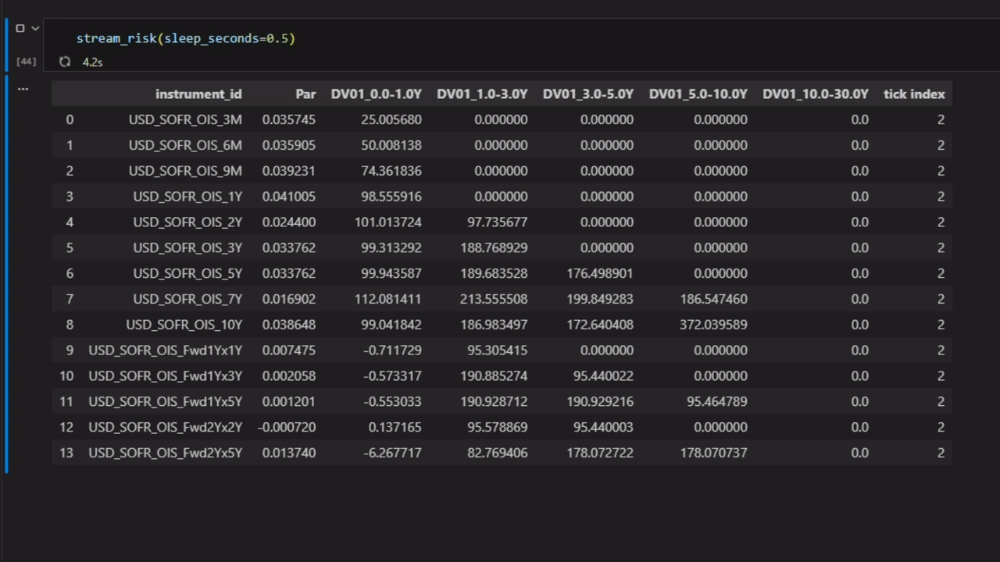

# fixed-income-ad-playground

<!-- 

 -->

This is a toy/playground for a fixed income library that uses algorithmic differentiation (via jax) for curve calibration, pricing and risk.

- **Github repository**: <https://github.com/carlosal15/fixed-income-ad-playground/>
<!-- - **Documentation** <https://carlosal15.github.io/fixed-income-ad-playground/> -->

## Requirements
- python 3.11+
# Quick Start
This is a toy python project to use JAX for performant curve calibration.

`pip install` this package wherever desired and you can run the example notebook in `notebooks/demo.ipynb`

## Motivation

In simple terms: pricing a fixed income instrument, like a swap, requires yield curves to act as forecasts of rates and/or discount factors. Yield curves themselves are calibrated to market quotes of fixed income instruments (as per some curveset config). Pricing is going from curve → quotes; calibration is going from quotes → curves.

By using algorithmic differentiation (AD), we can write only one of these paths and let AD “take care” of the reverse (i.e. the derivatives). That is, we define how to price a swap off some curve(s), and let AD provide the corresponding Jacobians of instrument prices with respect to curve parameters.

This idea is certainly not novel. Algorithmic differentiation has been around for more than half a century and is widely used in a number of fields. Machine learning in particular has resulted in the emergence of powerful libraries like PyTorch, TensorFlow, and JAX, which have made Python the dominant language for ML model development. Finance has also adopted similar approaches, for example to efficiently compute sensitivities of large portfolios via adjoint algorithmic differentiation (AAD).

Coming back to the problem of curve calibration with AD, a simple example appears in *Pricing and Trading Interest Rate Derivatives: A Practical Guide to Swaps* by J. H. M. Darbyshire (3rd edition, 2022). In it, he uses a forward-mode AD approach based on dual numbers to illustrate how one can calibrate a curve directly from swap quotes.

In this project, I explore the same core idea of how a fixed income quant library could use AD for both pricing and calibration, but using the JAX library. [JAX](https://docs.jax.dev/en/latest/) is a powerful library widely used in ML circles, with a NumPy-style API and extensive tooling. Particularly interesting is that it supports JIT compilation for lightning-fast computation while developing entirely at the Python level.

One can write relatively straightforward pricing functions and let JAX handle the computation and dispatch of Jacobians for an entire curveset. However, JAX also enforces a number of constraints. First, all code that runs inside JAX-compiled kernels must use JAX primitives (JAX arrays, `jax.numpy`, etc.) and avoid Python control flow that depends on traced values (e.g. standard `if` statements inside jitted code). This would mean that either the whole library must speak JAX, or that any public/user-facing API must translate inputs into JAX-compatible representations and sit on top of that JAX kernel. Second, JAX follows a functional programming model, which constrains OOP designs, dynamic dispatch, and inheritance-heavy architectures. Third, JIT-compiled functions are cached by input shapes; using the same function to price, say, 10 swaps first and then 100 swaps would require a new JIT compilation the second time around, with the corresponding overhead. Padding and batching strategies can help with this.

These constraints drive the design of such a library. The purpose of this toy project is to explore this design in a minimal setting, as well as to see what performance it could achieve. **In short**: it can calibrate a simple curveset with 50+ instruments in single digit milliseconds, and output a reusable jacobian (e.g. for risk).

This is good performance for the core calibration engine. Naturally, a production Python library would incur additional overhead from tooling unrelated to the core optimisation engine (conventions, dates, market data, orchestration, etc.), or one might use a C++ library that applies AD directly without relying on JIT compilation. But as a general idea for the plumbing behind a python quant library, I found it an interesting approach.

## What this package (currently) contains

At present, this package contains simple logic for curveset orchestration and calibration (with base curves and additive curves defined as spreads). At present, only swaps are implemented, and only stepwise-constant interpolators in instantaneous forward rates space (HJM), but stubs exist for other instruments (e.g. STIR futures) and interpolator types. The "jittable" kernel computation is used both for pricing and for calibration, as described above. There are also implemented regularization parameters/penalties for slope and curvature.

This package doesn't contain dates logic (there are stubs, but all 'dates' are currently bare year fractions), any info on conventions, or even any other instruments than vanilla swaps, at the moment. But all of that is easy to expand upon. It was written with the intention to flesh out a design that would enable that. As mentioned above, one of the main challenges of this approach is design constraints, so effort was made to accommodate it.

The functionality in this package (once more complete) could be plugged into an orchestrator with relative ease, that would know how to pass in any curve config and market data info.

We also include risk calculations for deltas and bucketed deltas that leverage the fast jacobians. See the example in the gif above with a toy portfolio.

## Performance
**In short**: it can evaluate a jacobian for ~50 swaps in tenths of a ms. The whole calibration is typically ~10x jacobian evaluation. Hence, a regular curveset would be on the order of ms, while only writing python code.

More testing needs to be done for bigger curvesets, as the scaling can theoretically be pretty bad (if $N$ is the number of calibration instruments and $K$ the curveset/knot parameters/penalties, a least squares solver requires Cholesky factorisation of a $K x K$ matrix with $O(K^3)$, and the $J^TJ$ operation with $O(NK^2)$).

One of the advantages of JAX, however, is that it natively supports GPU-acceleration. It remains to be tested, but it could result in extreme performance results.

## See for yourself
There's a simple jupyter notebook in the demos folder with some mock market data. Feel free to install this package and run it!

The notebook contains a quick show of how calibration works in this package, together with some benchmarks, and the example for "streaming" prices and risk included in the gif above.

## Pros & Cons of this approach

### Advantages
- The same code is used for pricing and calibration, ensuring consistency by design and reducing development work (quants are expensive!).
- Compiled performance while writing Python code.
- Optional GPU acceleration.

### Disadvantages
- The design must work around JAX constraints (functional-first style, limited OOP patterns, restricted control flow inside JIT).
- At least the kernel must be pure JAX; if another interface is required (e.g. NumPy), a translation layer is needed at the public API level.
- To prevent JIT warm-up overhead, function inputs should remain shape-stable as much as possible, which may require padding or packing strategies.
- Perhaps, is developer time really cut with a less versatile architecture?

## Goals and Non-goals

- Explore a design that uses JAX at the center of curve calibration, both in terms of implementation and achievable performance.
- Provide a demo public API for defining configurations, instrument conventions, requesting pricing and metrics, etc.
- Expand for other instruments and curve calibration settings while sticking to jittable code.
- Provide some simple date & conventions in order to build a more complete user api.

- **Non-goal**: building a production-ready fixed income library. This is an exploratory project focused on a core design idea. Or maybe it will evolve into a goal. Who knows.

## Who this is for
- Me.
- Anyone implementing curve calibration in Python who wants to explore what performance and design trade-offs are possible with AD and JAX.

<!-- # Architectural overview
To be filled in later. -->
## Architecture & API summary

This repo uses a **two-layer design** to balance flexibility with JAX performance:

### 1. Domain / API layer (Python, ~OOP)

This layer is not jitted and is designed forthe public interface. Essentially, python glue.

It includes:
- **Instruments** (`SwapSpec`, future stubs, etc.)
- **Quotes** and calibration configuration (`CurveSetConfig`)
- **Packing logic** (turning instruments into fixed-shape arrays)
- **Calibrator** orchestration
- **Pricers** (simple OO wrappers for pricing on calibrated curves)

This is where you would naturally add:
- new instrument types (futures, bonds, FRAs, etc.)
- conventions, calendars, dates
- reporting, diagnostics, API glue

Importantly, this layer **never performs math directly**: it delegates all numerical work to the kernel layer.

### 2. Kernel layer (JAX)

This layer contains pure JAX-friendly functions that operate only on arrays:
- discount factors
- pricing formulas
- penalty terms (slope, curvature, etc.)
- the **calibration residual vector** and **Jacobian via AD**

Key properties:
- no Python objects
- no dynamic dispatch
- no control flow on traced values
- fixed array shapes where possible

This is the only code that is `jit`-compiled and differentiated.

The **same kernel functions** are used for:
- pricing (par rates, discount factors)
- calibration (inside the residual vector)

Classes like `Curve` and `SwapPricer` are thin wrappers over these kernels.
They exist purely for API purposes.

The calibration "engine" does **not** call OO methods; it calls the kernel directly (it could be expanded with python code for extra logic or if the calibrator itself requires a user api, but that's the general idea).
Pricing may use OO wrappers, but those wrappers ultimately call the same kernels.

<!-- ### Extensibility

To add new functionality:
- New instrument type: add a new packed representation + kernel block (stubbed futures example).
- New curve interpolation: add a new kernel family + curve spec flag.
- New penalties/constraints: add residual blocks with fixed shapes.
 -->

### JIT & performance considerations
Expanding on what was metnioned above.

- JAX caches compiled kernels by function + array shapes + dtypes.
- Packing converts date-to-date instrument changes (missing quotes, schedule changes) into masked, fixed-shape arrays. We use a `ShapePolicy` that tries to keep shapes persisting by padding to fixed shapes.
- Calibration performance comes from:
  - compiled kernels
  - single AD pass for full Jacobian
  - reuse of compiled code across dates when shapes match
  - attempt to make shapes match!

